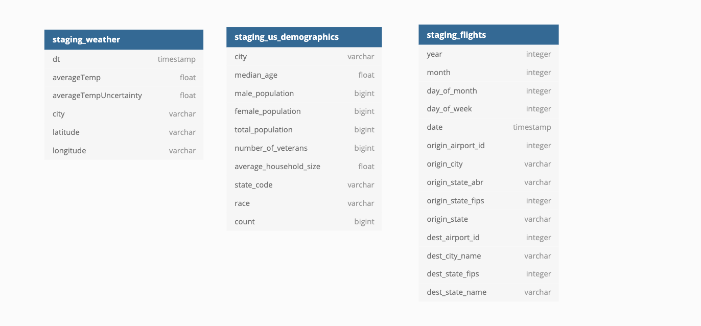
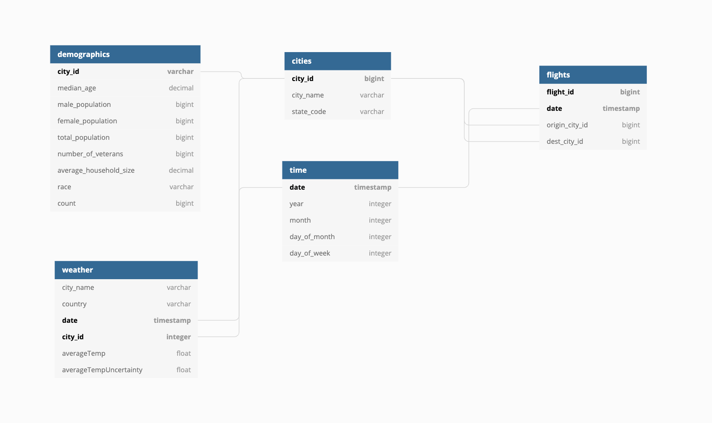
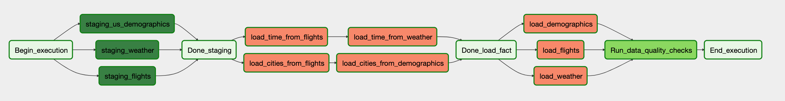

# DEND-Captsone
Capstone project for the data engineering nanodegree 

## SCOPE

This project was intended to demonstrate what I learned throughout the Udacity Data Engineering Nanodegree, specifically, creating ETL workflows using Apache Airflow, S3 and Redshift. We were allowed to choose our own data or use one of the data sets provided by Udacity. Udacity provided me with the weather and demographics data and I downloaded flight data from the Bureau of Transportation Statistics (BTS). The tables produced could be used to run various analyses related to travel. 

This ETL could be run as flight and/or weather data is collected. The BTS releases data on flights monthly so I would recommend configuring this pipeline to run once a month which is what it is currently configured to do. 

## Requirements 
* Python 3.6 
* Apache Airflow 

## Files and Directories 
* dend_capstone/create_tables_task.py - Airflow DAG to create tables in Redshift
* dend_capstone/etl_task.py - Airflow DAG to execute ETL task 
* dend_captsone/helpers - Contains Airflow operators and SQL statements 

## Instructions
Begin by 
## DATA  

* [Global Weather Data](https://www.kaggle.com/berkeleyearth/climate-change-earth-surface-temperature-data) - Weather data from around the world 
* [US Flight Data](https://www.transtats.bts.gov/DL_SelectFields.asp?Table_ID=236) - Flight data for US flights from 2009 - 2019
* [US Demographics Data](https://www.kaggle.com/berkeleyearth/climate-change-earth-surface-temperature-data) - Demographics for US cities 
## DATABASE SCHEMA

### Staging Tables 
* staging_weather
* staging_flights
* staging_demographics 

### Fact Tables 
* Flights
* Weather 
* Demographics 
### Dimension Tables
* cities 
* time 

### Staging Tables Image

### Schema Image 

## Workflow 

I used Apache Airflow to load the data from S3 to staging tables in Redshift. I then filled the fact and dimension tables by pulling data from the staging tables. 

## Difficulties 

I struggled with determining what schema would work better for this data.

## Conclusion 

In conclusion, this project allowed me to demonstrate my knowledge of data engineering technologies and practices. 
